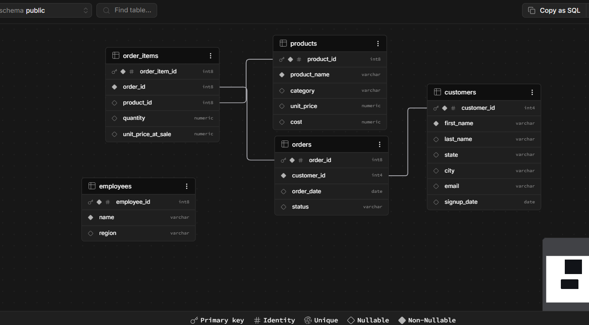

# Retail SQL Analytics

A SQL analytics project simulating an e-commerce database with 
customers, orders, products, order items, and employees.

## Schema
This is a basic sales data table created with supabase and added a image of the mapping schema

## Key Queries
- Top customers by spend
- Revenue by category over time
- Product ranking within category (window functions)
- Customer segmentation (CTE)
- Products frequently bought together (self-join)

## What I learned / debugged
Imported 1000 rows via CSV into Supabase (PostgreSQL). Found that 
null values in the source data were breaking joins between 
order_items and products — traced it to null data that was pulled from the csv file and some descimal issues , 
fixed by i scrubbed the data to fill properly.

## Tools
PostgreSQL (via Supabase), SQL