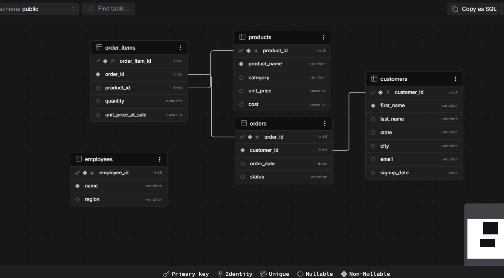

# Retail SQL Analytics

A SQL analytics project simulating an e-commerce database — customers, orders, products, order items, and employees — used to answer real business questions with joins, window functions, and CTEs.

Companion project: [retail-python-analysis](https://github.com/Fitbert/retail-python-analysis) connects to the same database with Python/pandas to chart the results.

## Schema

Five tables in PostgreSQL (hosted on Supabase):

- **customers** — first/last name, state, city, email, signup date
- **products** — name, category, unit price, cost
- **orders** — customer, order date, status
- **order_items** — order, product, quantity, unit price at time of sale
- **employees** — name, region

`order_items` links `orders` to `products`, so revenue is always computed as `quantity * unit_price_at_sale`. Full DDL is in [`schema.sql`](./schema.sql).

## Key queries

All in [`queries.sql`](./queries.sql):

- Total revenue by product category
- Customers signed up in the last 6 months
- Order count and status breakdown
- Top 10 customers by total spending
- Revenue by category by month
- Product ranking within category (window function: `RANK() OVER (PARTITION BY ...)`)
- Running total of revenue over time (window function)
- Customer segmentation — one-time vs. repeat vs. loyal buyers (CTE)
- Profit margin by category (revenue vs. cost)

## Notes

Data was imported via CSV into Supabase (PostgreSQL). The profit-margin query uses `NULLIF` to guard against divide-by-zero when a category has no recorded revenue, and the segmentation query uses a CTE to bucket customers by order count before aggregating.

*(There's a placeholder to fill in here about a specific null/join issue you ran into during the CSV import — worth adding once you recall the details.)*

## Tools

PostgreSQL (via Supabase), SQL
